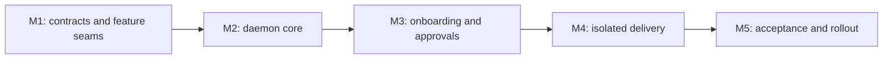

# OPC Current-User Daemon Implementation Plan

> **For agentic workers:** REQUIRED SUB-SKILL: Use superpowers:subagent-driven-development (recommended) or superpowers:executing-plans to implement this plan task-by-task. Steps use checkbox (`- [ ]`) syntax for tracking.

**Goal:** Replace the dedicated-user GitHub Actions Runner architecture with a maintainable Bun/TypeScript daemon that runs as the current user only after staged permission grants.

**Architecture:** Delivery is split into five blocking, independently verifiable plans. New code is feature-first; runtime callers use small deep-module interfaces, while GitHub, Telegram, Codex, sandbox, journal, and future App implementations sit at real adapter seams.

**Tech Stack:** Bun 1.3.8, TypeScript 5.9, TypeBox/AJV, `bun:sqlite`, `gh`, Codex CLI, Telegram Bot API, launchd, macOS sandbox.

---

## Authoritative inputs

- Design: [`../specs/2026-08-10-opc-current-user-daemon-design.md`](../specs/2026-08-10-opc-current-user-daemon-design.md)
- M1: [`2026-08-10-opc-daemon-m1-architecture-migration.md`](2026-08-10-opc-daemon-m1-architecture-migration.md)
- M2: [`2026-08-10-opc-daemon-m2-core.md`](2026-08-10-opc-daemon-m2-core.md)
- M3: [`2026-08-10-opc-daemon-m3-onboarding-approvals.md`](2026-08-10-opc-daemon-m3-onboarding-approvals.md)
- M4: [`2026-08-10-opc-daemon-m4-isolated-delivery.md`](2026-08-10-opc-daemon-m4-isolated-delivery.md)
- M5: [`2026-08-10-opc-daemon-m5-rollout.md`](2026-08-10-opc-daemon-m5-rollout.md)

## Blocking graph



M1 must preserve the legacy production path. M2 must remain disabled and use fake/temporary state. M3 may render a LaunchAgent but cannot activate without the third permission digest. M4 may publish only in deterministic integration fixtures. M5 is the first phase allowed to touch a user-supplied private sandbox repository, and final activation still requires a separate user command.

## Execution checkpoints

- [x] **Checkpoint 1: Complete M1 and review the architecture diff**

Evidence: five focused commits; lint, typecheck, tests, build, and diff check pass; no host mutation.

- [x] **Checkpoint 2: Complete M2 and review daemon durability**

Evidence: SQLite/in-memory adapter parity; same-digest submit idempotency; one-winner claim; exact lease boundaries; disabled loop has zero GitHub calls.

- [x] **Checkpoint 3: Complete M3 and review every capability grant**

Evidence: distinct onboarding/install/pairing/activation/uninstall digests; current `gh` identity and per-repository grants; independent `CODEX_HOME`; one-time durable Telegram pairing and replay-safe approval; config/SQLite/lifecycle authority fail closed across crash recovery; safe current-user LaunchAgent preview remains unactivated. Final M3 focused gate passes 149 tests / 884 expectations, full suite passes 763 tests / 2,251 expectations, lint/typecheck/build/diff checks pass, and independent whole-M3 Spec and Standards/security reviews report 0 findings.

- [ ] **Checkpoint 4: Complete M4 and review security probes before publication**

Evidence: target credential reads and network access fail; candidate review is independent; frozen tree produces one commit/push; Recovery budget is bounded.

- [ ] **Checkpoint 5: Complete M5 and ask for final activation approval**

Evidence: signed crash/security matrix; upgrade rollback; legacy runtime removed; real private sandbox URLs/digests recorded; `OPC_ENABLED=false` until the user runs the displayed activation command.

## Cross-plan invariants

1. No new macOS user, sudo, `/etc/codex`, system LaunchDaemon, GitHub Actions Runner, or global Git credential mutation.
2. No production command may read a PAT with `gh auth token` or export it to a child environment.
3. No feature imports a platform implementation; each feature exposes only `index.ts`.
4. No Target command receives Codex, GitHub, Telegram, SSH, or Keychain credentials.
5. Every state mutation is signed, idempotent, lease-owned, and preceded by current enabled/policy/digest checks.
6. Every scope expansion returns to approval; infrastructure failure never silently consumes a Work attempt.
7. Every plan task follows red-fail, minimal-green, focused verification, and one-purpose commit.

## Final program gate

Run each command separately:

```bash
rtk bun run lint
rtk bun run typecheck
rtk bun test
rtk bun run build
rtk proxy git diff --check origin/main...HEAD
rtk git status --short
```

Expected: all build/test commands exit 0, diff check emits no findings, and status is clean. If `origin/main` has moved during implementation, first fetch and review that change; never silently change the verification base.
