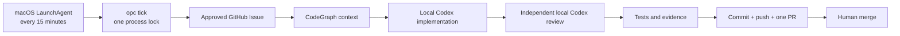

# Installer-First Root README Implementation Plan

> **For agentic workers:** REQUIRED SUB-SKILL: Use superpowers:subagent-driven-development (recommended) or superpowers:executing-plans to implement this plan task-by-task. Steps use checkbox (`- [ ]`) syntax for tracking.

**Goal:** Add a root README that takes a first-time macOS user from checkout through a verified development environment and the explicit current-user OPC setup path.

**Architecture:** Keep the root page installer-first and link to canonical documentation instead of duplicating it. Lock the page to current package scripts, the local LaunchAgent scheduler, the disabled-first safety boundary, and resolvable repository links with one focused Bun contract test.

**Tech Stack:** Markdown, Mermaid, Bun test, TypeScript, macOS LaunchAgent, GitHub CLI, Codex CLI, CodeGraph.

---

## File structure

- Create `README.md`: the installer-first project entry point, Quick Start, staged system setup, development commands, operations, troubleshooting, and canonical-document links.
- Create `test/unit/readme-contract.test.ts`: a focused documentation contract that rejects missing current commands, deprecated execution routes, and broken relative links.

### Task 1: Capture the missing README contract

**Files:**
- Create: `test/unit/readme-contract.test.ts`

- [ ] **Step 1: Write the failing contract test**

Create `test/unit/readme-contract.test.ts` with:

```ts
import { expect, test } from "bun:test";
import { readFile, stat } from "node:fs/promises";
import { dirname, join, resolve } from "node:path";
import { fileURLToPath } from "node:url";

const repositoryRoot = fileURLToPath(new URL("../..", import.meta.url));
const readmePath = join(repositoryRoot, "README.md");

test("documents the supported installer-first local OPC workflow", async () => {
  const readme = await readFile(readmePath, "utf8");

  for (const required of [
    "# OPC",
    "Bun 1.3.8",
    "gh auth status",
    "codex login status",
    "codegraph init -i",
    "codegraph status --json",
    "bun install --frozen-lockfile",
    "bun run typecheck",
    "bun run lint",
    "bun test",
    "bun run build",
    "bun run dev:local -- install",
    "bun run dev:local -- run-once",
    "bun run dev:local -- status",
    "bun run dev:local -- uninstall",
    "OPC_ENABLED=false",
    "human merge",
    "docs/architecture.md",
  ]) {
    expect(readme).toContain(required);
  }

  for (const supersededCommand of [
    "bun run dev:runner",
    "gh workflow run opc.yml",
    "actions-runner-osx",
  ]) {
    expect(readme).not.toContain(supersededCommand);
  }
});

test("resolves every repository-relative README link", async () => {
  const readme = await readFile(readmePath, "utf8");
  const links = [...readme.matchAll(/\]\(([^)]+)\)/gu)].map((match) => match[1]);
  expect(links.length).toBeGreaterThan(0);

  for (const link of links) {
    if (link === undefined || /^(?:https?:|#)/u.test(link)) continue;
    const path = decodeURIComponent(link.split("#", 1)[0] ?? "");
    expect(path).not.toBe("");
    const target = resolve(dirname(readmePath), path);
    const entry = await stat(target);
    expect(entry.isFile() || entry.isDirectory()).toBe(true);
  }
});
```

- [ ] **Step 2: Run the focused test and verify RED**

Run:

```bash
bun test test/unit/readme-contract.test.ts
```

Expected: FAIL with `ENOENT` for the missing root `README.md`.

- [ ] **Step 3: Commit the RED contract**

```bash
git add test/unit/readme-contract.test.ts
git commit -m "test: require installer-first root readme"
```

### Task 2: Write the installer-first README

**Files:**
- Create: `README.md`
- Test: `test/unit/readme-contract.test.ts`

- [ ] **Step 1: Add the complete root README**

Create `README.md` with this content:

````markdown
# OPC

OPC turns an approved GitHub Issue into a reviewed pull request from your own
Mac. A private current-user LaunchAgent wakes every 15 minutes, runs one
short-lived local tick, uses CodeGraph and two independent Codex sessions, runs
the repository evidence commands, and creates or reuses one deterministic
branch, commit, and pull request. A human merge is always the final boundary.

OPC currently supports current-user installation on macOS. It does not require
`sudo`, a dedicated user, GitHub Actions scheduling, or a self-hosted runner.



## Requirements

- macOS on an ordinary current-user account
- [Bun](https://bun.sh/) 1.3.8 or later
- Git
- [GitHub CLI](https://cli.github.com/) authenticated to the repository owner
- [Codex CLI](https://developers.openai.com/codex/cli/) authenticated with ChatGPT
- CodeGraph CLI 0.9.3 or later
- One private, non-fork Target Repository owned by the authenticated GitHub user

OPC uses the credentials already owned by the current user. Do not copy tokens,
Codex credentials, SSH keys, or GitHub credentials into OPC configuration.

## Five-minute developer Quick Start

Clone the control repository and install its dependencies:

```bash
git clone git@github.com:devos-ing/opc-it.git
cd opc-it
bun install --frozen-lockfile
```

Verify the checkout before installing anything on the Mac:

```bash
bun run typecheck
bun run lint
bun test
bun run build
```

Verify the external tools and logins:

```bash
bun --version
git --version
gh auth status
codex login status
codegraph --version
```

Create and authenticate the isolated current-user Codex home used by OPC:

```bash
export OPC_CODEX_HOME="$HOME/Library/Application Support/OPC/codex"
install -d -m 700 "$OPC_CODEX_HOME"
CODEX_HOME="$OPC_CODEX_HOME" codex login
CODEX_HOME="$OPC_CODEX_HOME" codex login status
```

Initialize CodeGraph once in a fresh clone, then verify a non-empty index:

```bash
codegraph init -i
codegraph sync "$PWD"
codegraph status --json "$PWD"
```

`codegraph status --json` must report `initialized: true` with positive file and
node counts. Stop here if authentication, the build, tests, or CodeGraph fails.

## Set up OPC on this Mac

The system setup is deliberately staged. Keep both controls disabled until one
foreground tick has been verified:

```bash
export OPC_REPOSITORY="<github-login>/<private-repository>"
gh variable set OPC_ENABLED --body false --repo "$OPC_REPOSITORY"
```

The target checkout's committed `.codex-pipeline.yml` must also contain:

```yaml
enabled: false
```

### 1. Install the reviewed CLI bytes for the current user

Build first, then install only the generated CLI into private current-user
paths. The symlink gives the shell a stable `opc` command while the scheduler
binds the real installed file.

```bash
bun run build
install -d -m 700 "$HOME/.local/bin"
install -d -m 700 "$HOME/Library/Application Support"
install -d -m 700 "$HOME/Library/Application Support/OPC"
install -d -m 700 "$HOME/Library/Application Support/OPC/dist"
install -d -m 700 "$HOME/Library/Logs/OPC"
install -m 700 dist/cli.js "$HOME/Library/Application Support/OPC/dist/cli.js"
ln -sfn "$HOME/Library/Application Support/OPC/dist/cli.js" "$HOME/.local/bin/opc"
export PATH="$HOME/.local/bin:$PATH"
opc help
```

### 2. Complete approved current-user onboarding

Onboarding binds the exact GitHub login, repository, home, paths, Telegram
approval identity, and disabled LaunchAgent configuration. The Target must be a
private, non-fork repository owned by that same login. Export its closed input:

```bash
export OPC_REPOSITORY="<github-login>/<private-repository>"
export OPC_GITHUB_LOGIN="<github-login>"
export OPC_ONBOARDING_INPUT="$(bun -e '
const home = process.env.HOME;
const repository = process.env.OPC_REPOSITORY;
const login = process.env.OPC_GITHUB_LOGIN;
console.log(JSON.stringify({
  githubLogin: login,
  currentHome: home,
  repositories: [{
    name: repository,
    private: true,
    fork: false,
    owner: repository.split("/")[0],
  }],
  paths: {
    binary: `${home}/.local/bin/opc`,
    applicationSupport: `${home}/Library/Application Support/OPC`,
    logs: `${home}/Library/Logs/OPC`,
    launchAgent: `${home}/Library/LaunchAgents/com.getsuperpower.opc.plist`,
    codexHome: `${home}/Library/Application Support/OPC/codex`,
  },
}));
')"
export OPC_APPROVED_GITHUB_IDENTITY="github.com:${OPC_GITHUB_LOGIN}"
export OPC_APPROVED_REPOSITORIES="[\"${OPC_REPOSITORY}\"]"
```

Preview the identity stage, inspect its JSON, and copy its `result.digest` into
the apply command:

```bash
export OPC_ONBOARDING_STAGE=identity
opc onboard --preview
opc onboard --apply 'sha256:<identity-preview-digest>'
```

Preview the disabled install stage. Applying it requires the Telegram bot token
on standard input; OPC does not print or place that token in its configuration:

```bash
export OPC_ONBOARDING_STAGE=install
opc onboard --preview
printf '%s\n' "$TELEGRAM_BOT_TOKEN" | \
  opc onboard --apply 'sha256:<install-preview-digest>' --telegram-token-stdin
```

Send the returned challenge code to the configured Telegram bot. Preserve the
returned `result.next` object exactly, then complete pairing:

```bash
export OPC_ONBOARDING_STAGE=pairing
export OPC_TELEGRAM_PAIRING_PREVIEW='<exact-result.next-json>'
opc onboard --apply 'sha256:<pairing-preview-digest>'
```

Preserve the returned activation preview for the later explicit activation:

```bash
export OPC_ACTIVATION_PREVIEW='<exact-activation-preview-json>'
```

Do not run `opc activate` yet.

### 3. Install and prove the local scheduler while disabled

Use the exact canonical checkout path. For this repository, run from its root:

```bash
bun run dev:local -- install \
  --repository "$OPC_REPOSITORY" \
  --checkout "$PWD"

bun run dev:local -- run-once
bun run dev:local -- status
```

The foreground result should be `disabled`, `busy`, `idle`, or `worked`; during
initial setup it should remain disabled. The scheduler is installed for the
current user only and executes at most one repository delivery per tick.

### 4. Enable only after the disabled proof

Review the exact activation preview, enable the committed repository policy,
set the GitHub kill switch, then activate the same approved local authority:

```bash
# Edit and commit .codex-pipeline.yml so it contains: enabled: true
gh variable set OPC_ENABLED --body true --repo "$OPC_REPOSITORY"
opc activate 'sha256:<activation-preview-digest>'
bun run dev:local -- status
```

If any identity, repository, checkout, digest, policy, permission, or file has
changed since its preview, activation fails closed. Re-preview instead of
forcing the operation.

## Development

```bash
bun test                 # full test suite
bun run test:watch       # tests during development
bun run typecheck        # strict TypeScript validation
bun run lint             # ESLint
bun run build            # build dist/cli.js
```

The main code areas are:

- `src/domain/`: state and authority rules
- `src/features/`: queue, onboarding, approvals, delivery, and scheduler logic
- `src/platform/`: GitHub, Git, Codex, CodeGraph, sandbox, and macOS adapters
- `src/runtime/`: one-tick orchestration and recovery
- `src/cli/`: public commands and production composition
- `test/`: unit, contract, integration, and acceptance evidence

Use CodeGraph for structural questions such as callers, callees, impact, and
symbol context. Use text search only for literal strings and documentation.

## Operations

Run and inspect the scheduler manually:

```bash
bun run dev:local -- run-once
bun run dev:local -- status
tail -n 100 "$HOME/Library/Logs/OPC/daemon.stdout.log"
tail -n 100 "$HOME/Library/Logs/OPC/daemon.stderr.log"
```

Stop new work before maintenance:

```bash
gh variable set OPC_ENABLED --body false --repo "$OPC_REPOSITORY"
```

Remove only scheduler-owned local state:

```bash
bun run dev:local -- uninstall
```

Uninstall does not delete repositories, Issues, branches, pull requests,
credentials, or retained legacy Runner state.

## Troubleshooting

- **`DEV_LOCAL_SCHEDULER_AUTH_FAILED`:** run `gh auth status` and confirm the
  active account is an administrator of the target repository.
- **`DEV_LOCAL_SCHEDULER_CODEGRAPH_FAILED`:** run `codegraph sync "$PWD"` and
  inspect `codegraph status --json "$PWD"`; initialize first if needed.
- **`DEV_LOCAL_SCHEDULER_DISABLED_STATE_FAILED`:** initial installation requires
  both `OPC_ENABLED=false` and committed `.codex-pipeline.yml` `enabled: false`.
- **`DEV_LOCAL_SCHEDULER_CHECKOUT_FAILED`:** use the real canonical repository
  root inside the current user's home; its `origin` must match the allowlist.
- **`DEV_LOCAL_SCHEDULER_DAEMON_CONFIG_FAILED`:** rerun the approved onboarding
  preview/apply sequence; do not hand-edit the private daemon configuration.
- **Busy result:** another tick owns the process lock. Wait for it to finish;
  do not delete SQLite lock files.

## Safety boundaries

- One current-user LaunchAgent runs one short-lived tick every 15 minutes.
- One SQLite exclusive lock and `max_concurrency=1` prevent overlap.
- Each tick handles at most one approved Work or Recovery Issue.
- Implementation and review use separate local Codex sessions.
- Codex never receives publisher credentials.
- Publication is limited to one deterministic branch, commit, and PR.
- OPC never pushes directly to the default branch and never merges a PR.
- Policy, approval, base SHA, and repository authority are revalidated before
  each mutation boundary.

## Project documentation

- [Domain language](CONTEXT.md)
- [Current architecture](docs/architecture.md)
- [Approved designs](docs/design/)
- [Specifications](docs/specs/)
- [Architecture decisions](docs/adr/)

Historical plans and evidence live under `docs/superpowers/` and `.scratch/`;
they are not the canonical description of current behavior.
````

- [ ] **Step 2: Run the focused contract and verify GREEN**

Run:

```bash
bun test test/unit/readme-contract.test.ts
```

Expected: 2 pass, 0 fail.

- [ ] **Step 3: Manually render-check the Mermaid and command blocks**

Check `README.md` in GitHub Markdown preview. Confirm the flowchart renders, all
shell blocks preserve quoting, and the page does not suggest GitHub Actions,
self-hosted Runner registration, `sudo`, automatic enablement, or automatic
merge.

- [ ] **Step 4: Commit the README**

```bash
git add README.md
git commit -m "docs: add installer-first project readme"
```

### Task 3: Verify the complete documentation slice

**Files:**
- Verify: `README.md`
- Verify: `test/unit/readme-contract.test.ts`

- [ ] **Step 1: Run the focused README contract again**

```bash
bun test test/unit/readme-contract.test.ts
```

Expected: 2 pass, 0 fail.

- [ ] **Step 2: Run static gates**

```bash
bun run typecheck
bun run lint
git diff --check
```

Expected: every command exits 0.

- [ ] **Step 3: Run the full suite**

```bash
bun test
```

Expected: all tests pass, including the two new README contract tests.

- [ ] **Step 4: Confirm the final scope**

```bash
git status --short
git log --oneline -3
```

Expected: a clean worktree whose only new implementation commits are the README
contract and README, following the already-approved specification commit.
