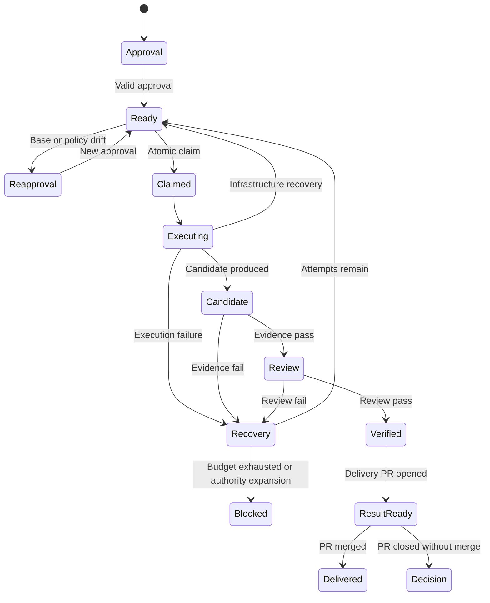

# OPC 无人值守交付系统设计

- 状态：已完成逐节设计批准，等待最终文档审阅
- 日期：2026-08-08
- 版本：v1 设计
- 控制仓库：`OPC`
- 领域词汇：[CONTEXT.md](../../../CONTEXT.md)
- 架构图：[OPC 无人值守交付架构](../visuals/opc-architecture.html)
- 方案比较：[为什么 v1 不直接写 Daemon](../visuals/why-not-daemon.html)

## 1. 结论

OPC v1 使用标准 GitHub Actions、官方 `openai/codex-action` 和一台专用 Mac mini self-hosted macOS runner，实现从批准计划到验证结果的无人值守交付。

人的参与被严格限制为：

1. 在 Codex Desktop 中 grill、审阅并批准一个 Milestone Contract。
2. 审阅最终 Delivery Pull Request。
3. 只在重新批准、Needs Decision 或 Terminal Blocker 时介入。

GitHub Issues 是队列和审计记录，GitHub Actions 是调度器，OPC CLI 是与调度器解耦的 Orchestration Core。执行失败或不符合计划时，系统在原授权范围内自动创建 Recovery Issue 并继续，最多执行三次。系统永不自动 merge。

## 2. 目标

### 2.1 产品目标

- 将已批准的一个里程碑自动转换为可执行的 GitHub Work Issue。
- 在用户不监控过程的前提下完成领取、执行、验证、恢复、commit、push 和 PR 创建。
- 使用确定性 Evidence Gate 与独立 Result Review 防止“任务跑完但没有达到计划”的假完成。
- 将失败变成有证据、可去重、受预算限制的 Recovery Issue，而不是无限重试或 Issue 风暴。
- 保留完整、可查询的授权、状态、证据和结果链路。
- 让 GitHub Actions 与未来 daemon 共用同一个 OPC CLI，避免核心状态机绑定调度平台。

### 2.2 人的时间目标

- 不要求查看 Actions 日志、队列状态、心跳或中间重试。
- Routine progress、Run Incident 和 Recovery Issue 默认不通知用户。
- 只有 Attention Event 主动要求用户处理。

### 2.3 非目标

v1 不支持：

- 自动 merge。
- 公开仓库或 fork PR 触发执行。
- 跨 GitHub owner/organization。
- 同一仓库并行执行多个 Work Issue。
- 自建 Dashboard、Slack 或额外邮件集成。
- Docker、GitHub Agentic Workflows 或常驻 OPC daemon。
- 自动扩大 scope、可写路径、网络、资源或验收标准。

## 3. 调研与方案选择

### 3.1 方案 A：GitHub Actions 调度，OPC CLI 执行

这是 v1 选择。

- GitHub 负责事件、定时任务、队列、并发控制、运行历史和 job-scoped token。
- Mac mini 只运行官方 self-hosted runner service。
- Reusable Workflow 只作为薄 adapter 调用 OPC CLI。
- GitHub Issues、Actions、branches 和 pull requests 是唯一持久状态，不增加数据库或 Redis。

GitHub 官方支持 macOS self-hosted runner，并列出 ARM64 支持；同一用户或组织拥有的 reusable workflow 可以使用调用方上下文可访问的 self-hosted runner。

### 3.2 方案 B：Mac mini 常驻 daemon

暂不采用。

daemon 仍要调用相同的 OPC CLI，同时还要自行承担 poller 或 webhook、队列、租约存储、幂等、补漏、凭证保管、watchdog、日志保留和升级。`launchd` 可以重启退出的进程，但不能独立判断逻辑卡死、状态损坏或凭证过期；若负责发现任务的 daemon 本身失效，系统可能静默停止。

如果 GitHub Actions 的队列、鉴权、跨组织或调度限制成为可测量的阻碍，v2 可以增加 daemon adapter，而不重写 Orchestration Core。

### 3.3 方案 C：Temporal 等 Durable Execution 平台

暂不采用。

Temporal 适合大量跨服务、跨天运行且必须从故障点恢复的关键工作流，但当前需求是一台 Mac mini、每仓库串行和最多三次执行。引入额外服务与运维面不符合 v1 的复杂度预算。

### 3.4 为什么不使用 gh-aw

GitHub Agentic Workflows 提供 agent workflow、安全输出和失败 Issue 等相近能力，但其 self-hosted 运行路径以 Linux 和 Docker 为边界，不能直接满足 Mac mini 原生 macOS runner 的目标。v1 因此使用标准 GitHub Actions 与官方 Codex Action，并自行实现较小、明确的状态机。

## 4. 系统边界

### 4.1 Trust Domain

- `OPC` Control Repository 与全部 Target Repository 位于同一 GitHub owner 或 organization。
- 仅 allowlist 内的私有仓库可以接入。
- 仅 allowlist 内的 owner 可以产生 Plan Approval。
- fork、公开仓库事件和外部 PR 不能触发执行。
- v1 不使用长期 PAT 或自建 GitHub App；每个 Target Repository 使用自己的 `GITHUB_TOKEN`。

### 4.2 控制仓库

`OPC` 版本化：

- Reusable Workflows。
- OPC CLI。
- JSON Schema 与 canonicalization 实现。
- Issue、Result Manifest、Result Review 和 Recovery Addendum 模板。
- 状态转换、fingerprint、Evidence Gate 和恢复策略。
- executor 与 reviewer 的模型配置别名。

Target Repository 通过 commit SHA 固定调用的 OPC 版本，避免未经批准的中央更新改变正在执行的行为。

### 4.3 目标仓库

每个 Target Repository 只增加：

- `.codex-pipeline.yml` Repository Policy。
- 一个薄 caller workflow。
- OPC labels 与 Issue template。

Work Issue、Recovery Issue、Action run、artifact、delivery branch 和 Delivery Pull Request 全部保留在该仓库。

## 5. 总体架构

```mermaid
flowchart LR
    Human["Codex Desktop<br/>Grill 与 Plan Approval"] --> Issue["Work Issue<br/>Milestone Contract 与 Approval Digest"]
    Issue --> Trigger["Ready event<br/>加 15 分钟 Reconciliation Sweep"]
    Trigger --> Claim["Repository Queue<br/>与 Work Claim"]
    Claim --> Runner["Mac mini Runner"]
    Runner --> Core["OPC CLI"]
    Core --> Executor["Codex Executor"]
    Executor --> Candidate["Candidate Result<br/>与 Evidence Bundle"]
    Candidate --> Gate["Evidence Gate"]
    Gate --> Review["Independent Result Review"]
    Review -->|Pass| Publish["Write-only Publisher"]
    Publish --> PR["Delivery Pull Request"]
    Review -->|Fail| Recovery["Recovery Issue"]
    Recovery --> Claim
    Recovery -->|预算耗尽或需要扩权| Blocker["Terminal Blocker"]
```



### 5.1 GitHub Actions jobs 与权限

| Job | 运行位置 | Repository code | OpenAI credential | GitHub 权限 | 职责 |
|---|---|---:|---:|---|---|
| `dispatch-and-claim` | GitHub-hosted | 不执行 | 无 | Issues write，Actions/Contents read | 验证授权、选择队首、创建 Work Claim |
| `execute` | Mac mini | 执行 | 有 | Contents read | 创建 Execution Workspace，运行 Codex 和 Evidence Gate |
| `review` | Mac mini | 只读 | 有 | Contents read | 新会话独立审查合约、diff 与 Evidence Bundle |
| `recover` | GitHub-hosted | 不执行 | 无 | Issues write | 创建去重 Recovery Issue 或 Terminal Blocker |
| `publish` | GitHub-hosted | 不执行脚本 | 无 | Contents/PR/Issues write | 验证 artifact，创建 commit、branch 和 PR |

权限按 job 明确声明。下游 reusable workflow 只能维持或降低 caller 提供的 `GITHUB_TOKEN` 权限，不能自行提权。

Target Repository checkout 使用 `persist-credentials: false`。OPC 在启动 Codex 前准备好所需上下文，并从 Codex 子进程环境移除 GitHub token；`Contents read` 只供受控 checkout 与编排步骤使用。OpenAI credential 只传给 Codex Action step，不传给 bootstrap、Evidence commands 或 publisher。

### 5.2 Mac mini 隔离

- 使用专用 macOS runner 用户。
- 不登录 iCloud，不存放个人文件，不使用日常开发用户的 SSH Agent 或 Keychain。
- 每次尝试创建新的 disposable worktree。
- Codex 使用 `workspace-write` sandbox，workload 默认断网。
- OpenAI credential 只存在于 executor 和 reviewer job。
- executor job 最多只有 GitHub read 权限，Codex 子进程不接收 GitHub token。
- 结束后移除 worktree、临时文件和 job-scoped credential。
- v1 的隔离弱于 VM 或容器，因此私有仓库、owner approval 和 Repository Policy 是强制补偿控制。

## 6. 端到端流程

### 6.1 计划与批准

1. 用户在 Codex Desktop 发起 grill。
2. Codex 读取目标仓库当前 default branch SHA 和 `.codex-pipeline.yml`。
3. Codex 生成一个机器可读 Milestone Contract，并展示人类可读计划。
4. 用户明确批准一个 milestone。
5. `opc plan publish` 验证 schema，将 YAML 转为 canonical JSON，计算 Approval Digest。
6. 使用用户当前 GitHub 身份创建 Work Issue，并发布精确的 `/opc approve sha256:<digest>` 审批记录。
7. Issue 进入 `opc:ready`。

Plan Approval 只授权该 Milestone Contract，不授权相邻工作、后续 milestone 或隐含 scope。

### 6.2 触发与领取

1. `opc:ready` 状态变化立即触发 caller workflow。
2. 每 15 分钟 Reconciliation Sweep 搜索被遗漏、被中断或租约过期的工作。
3. repository-scoped concurrency gate 串行化 claim。
4. OPC 按以下顺序选择一条 Issue：
   1. 有剩余预算的 Recovery Issue，按创建时间 FIFO。
   2. 普通 Work Issue，按 Plan Approval 时间 FIFO。
5. 在 gate 内再次校验 owner、Trust Domain、schema、Approval Digest、base SHA、policy SHA、预算与状态。
6. 写入 Work Claim、Action run id、attempt number 和 lease 信息。

一个 Target Repository 同时最多有一个 active Work Claim。单台 runner 自身一次也只处理一个 job；跨仓库任务由 GitHub runner queue 排队。

十五分钟是目标扫描频率而不是实时 SLA；GitHub scheduled workflow 可能延迟，因此 Ready event 是主触发器，Reconciliation Sweep 只是补漏机制。

### 6.3 执行

1. 在批准的 `base_sha` 创建 Execution Workspace。
2. 编排器在注入 OpenAI credential 前，按 Repository Policy 的独立 bootstrap network policy 执行固定 bootstrap 命令。
3. Codex executor 获得：
   - Milestone Contract。
   - Repository Policy 的收紧视图。
   - Recovery Addendum（如果存在）。
   - 当前代码与 OPC 预先提取的只读 GitHub 上下文。
4. Codex 只修改批准路径，不 commit、不 push、不创建 PR。
5. 编排器检查路径、文件类型、artifact 大小和 policy compliance。
6. 编排器执行固定 Evidence commands。
7. 产出 content-hashed Result Manifest、文件内容包和脱敏 Evidence Bundle。

### 6.4 结果审查

reviewer 是新的只读 Codex 会话：

- 不读取 executor 的 reasoning 或对话。
- 不修改候选结果。
- 只读取 Milestone Contract、diff、Result Manifest 和 Evidence Bundle。
- 逐条把 acceptance criterion 映射到证据。
- 检查 out-of-scope、意外路径与 material risk。
- 只输出 schema-validated `pass` 或 `fail`。

executor 不能批准自己的结果。Evidence Gate 通过也不能跳过 Result Review。

### 6.5 发布

publisher 只有在以下全部成立时运行：

- Approval Digest 仍有效。
- base SHA 与 policy SHA 仍匹配。
- Evidence Gate 通过。
- Result Review 为 `pass`。
- artifact 总 hash、每个文件 hash、路径与 mode 全部有效。

如果执行期间 default branch 或 Repository Policy revision 发生变化，publisher 不写入任何 branch 或 PR；Candidate Result 保留作审计，Work Issue 进入 `opc:needs-reapproval`，且不创建 Recovery Issue。

publisher 不执行 repository-controlled code。v1 使用 GitHub Git Data API 或等价的无脚本写入方式，从已验证的完整文件内容创建 blobs、tree、commit 和 `codex/opc-<work-id>` branch，然后创建 ready-for-review Delivery Pull Request。

v1 只允许普通文件 mode；symlink、submodule 和特殊文件结果进入 Recovery Issue，除非未来 Repository Policy 明确增加支持。

### 6.6 人类完成交付

- PR 创建后，Work Issue 进入 `opc:result-ready`，但保持打开。
- 用户合并 PR 后，Work Issue 与整条 Recovery Issue chain 标记 Delivered 并关闭。
- 用户未合并而关闭 PR，Work Issue 进入 Needs Decision；系统不自动重试或丢弃工作。

## 7. 状态模型

### 7.1 状态

| Label | 含义 | 可离开方式 |
|---|---|---|
| `opc:needs-approval` | 合约尚未有效批准 | owner approval |
| `opc:ready` | 可以进入 Repository Queue | claim 或 drift |
| `opc:claimed` | 已有排他 Work Claim | execution、lease recovery |
| `opc:running` | 正在执行或验证 | candidate、failure、incident |
| `opc:reviewing` | 独立 Result Review | verified、failure |
| `opc:recovering` | 等待同范围 Recovery Issue | recovery ready、blocked |
| `opc:result-ready` | Delivery PR 等待用户 | merge、close without merge |
| `opc:needs-reapproval` | Base Drift、Policy Drift 或授权内容变化 | new Plan Approval |
| `opc:needs-decision` | PR 未合并关闭 | owner decision |
| `opc:blocked` | Terminal Blocker | new human authority |
| `opc:delivered` | 已合并并完成 | terminal |

Labels 是状态投影，不是授权凭证。所有转换由 OPC CLI 使用转换前置条件完成。

### 7.2 关键转换



人工取消不会自动恢复。恢复必须由新的显式用户动作决定，防止 kill switch 被系统绕过。

## 8. 数据合约

### 8.1 Repository Policy

```yaml
version: 1
enabled: true
approvers: [roy]

runner:
  labels: [self-hosted, macOS, ARM64, opc]

limits:
  timeout_minutes: 90
  max_attempts: 3
  evidence_bundle_mb: 100

paths:
  writable: [src/**, tests/**, docs/**]
  forbidden: [.github/**, .env*, secrets/**]

commands:
  bootstrap: npm ci --ignore-scripts
  evidence:
    - id: unit-tests
      run: npm test
    - id: build
      run: npm run build

network:
  bootstrap:
    mode: allowlist
    allow_domains: [registry.npmjs.org]
  agent:
    mode: deny

environment_allowlist: [CI, NODE_ENV]
```

Repository Policy 是权限上限。Milestone Contract 只能进一步收紧。缺失、无效或 `enabled: false` 的仓库不能进入队列。

Bootstrap 与 Evidence commands 由 OPC 编排器执行；agent 不能替换这些命令。bootstrap egress 与 agent egress 是不同权限，默认示例只允许 bootstrap 访问包仓库，而 Codex 断网。若 runner 无法强制执行所声明的网络模式和域名 allowlist，仓库 onboarding 必须失败，不能静默放宽。Codex 的普通代码探索仍受 sandbox、可写路径、断网、专用账户和无写凭证共同约束。

### 8.2 Milestone Contract

```yaml
kind: Work
contract_version: 1
work_id: opc-uuid
base_sha: abc123
policy_sha: def456

goal: 增加指定功能
in_scope:
  - src/feature/**
out_of_scope:
  - 数据库迁移
  - 部署配置

acceptance:
  - id: AC-1
    statement: 指定行为可以正常工作
    evidence: unit-tests
  - id: AC-2
    statement: 项目可以完成构建
    evidence: build

limits:
  timeout_minutes: 60
  attempts: 3
```

YAML parser 必须拒绝 duplicate keys、自定义 tags 和 aliases。schema validation 后使用确定性 canonical JSON 表示计算 SHA-256 Approval Digest。`policy_sha` 是 Repository Policy 同样 canonicalize 后的 SHA-256。

以下变化全部使批准失效：

- 合约字段变化。
- 审批记录缺失、被编辑、作者不在 allowlist 或 digest 不匹配。
- default branch 不再等于 `base_sha`。
- Repository Policy 不再等于 `policy_sha`。

### 8.3 Result Manifest

```json
{
  "kind": "CandidateResult",
  "work_id": "opc-uuid",
  "attempt": 1,
  "approval_digest": "sha256:...",
  "base_sha": "abc123",
  "artifact_sha256": "sha256:...",
  "changes": [
    {
      "path": "src/feature.ts",
      "operation": "modify",
      "mode": "100644",
      "content_sha256": "sha256:..."
    }
  ],
  "evidence": [
    {
      "id": "unit-tests",
      "status": "pass",
      "exit_code": 0,
      "log_sha256": "sha256:..."
    }
  ],
  "duration_seconds": 840
}
```

### 8.4 Result Review

```json
{
  "decision": "pass",
  "criteria": [
    {
      "id": "AC-1",
      "status": "satisfied",
      "evidence": ["unit-tests"]
    }
  ],
  "scope_status": "inside_contract",
  "unexpected_paths": [],
  "material_risks": []
}
```

任何 schema 错误、未知 criterion、缺失 evidence 或非二元 decision 都视为 review failure，而不是默认通过。

### 8.5 Recovery Addendum

```yaml
kind: Recovery
root_work_id: opc-uuid
parent_issue: 123
attempt: 2
approval_digest: sha256:...
failure_type: evidence
error_fingerprint: sha256:...
evidence_links: []
repair_hypothesis: 修复指定失败
verification_focus: unit-tests
```

Recovery Addendum 只能增加失败上下文，不能替换或修改原 Milestone Contract。

## 9. 领取、心跳与幂等

### 9.1 原子领取

- workflow 使用 repository-scoped concurrency gate。
- `dispatch-and-claim` 在 gate 内重新读取 Issue 与 approval。
- 只有 `opc:ready` 且没有 active claim 的 Issue 可以被领取。
- claim 记录 `work_id`、attempt、run id、claimed_at 和 lease deadline。
- 重复 event、cron 或 workflow replay 在同一 gate 内返回 no-op。

### 9.2 Claim Lease

- execution wrapper 每五分钟产生一个最小 heartbeat artifact 或等价的 Actions liveness signal，不需要 GitHub repository write token。
- Reconciliation Sweep 每十五分钟检查 active run 与最后 heartbeat。
- 连续三十分钟没有有效 liveness，claim 过期并可重新进入 `opc:ready`。
- 基础设施中断不消耗 Recovery Budget。
- 连续二十四小时无法运行，形成 Terminal Blocker。

### 9.3 Error fingerprint

fingerprint 输入包含：

- failure type。
- evidence command 或 acceptance criterion id。
- 规范化错误类别与稳定错误片段。
- 相关 base SHA。

动态时间戳、临时路径、随机 id 和 secret 在 hash 前移除。相同 root work、attempt chain 和 fingerprint 只允许存在一条 open Recovery Issue。

## 10. 失败分类与恢复

### 10.1 Execution Failure

Codex、bootstrap、构建或执行过程在有效运行环境中失败。创建 Recovery Issue，消耗一次执行预算。

### 10.2 Conformance Failure

Evidence Gate 或 Result Review 未通过。创建 Recovery Issue，消耗一次执行预算。

### 10.3 Run Incident

Mac mini 离线、GitHub/OpenAI/API 暂时不可用或 runner 未能可靠启动。记录在原 Work Issue 对应的 Actions/Check 中，自动恢复，不创建 Recovery Issue，不消耗预算。

### 10.4 Bounded Recovery

- 总执行次数为三次：初次执行加最多两条 Recovery Issue。
- Recovery Issue 在 Repository Queue 中优先于新 Work Issue。
- 同一授权范围内自动进入队列，不通知或指派用户。
- 需要扩大 scope、权限、路径、网络、资源或改变验收标准时立即停止，进入新的 Plan Approval。
- 第三次工作失败形成 Terminal Blocker。

## 11. Base Drift 与 Policy Drift

领取前必须比较当前 default branch 与 `base_sha`，并比较当前 Repository Policy hash 与 `policy_sha`。

任一不匹配：

1. 不执行、不 rebase、不消耗 Recovery Budget。
2. 自动生成 change-impact summary。
3. Issue 进入 `opc:needs-reapproval`。
4. 返回 Codex Desktop 请求新的 Plan Approval。

v1 不尝试判断代码变化“看起来无关”后自动重签，因为这种判断会把批准权转交给系统。

## 12. Execution Envelope

| 项目 | 系统上限 |
|---|---:|
| 单次执行 wall time | 90 分钟 |
| 独立 Result Review | 15 分钟 |
| 总执行次数 | 3 |
| Evidence Bundle | 100 MB |
| heartbeat | 5 分钟 |
| lease expiry | 30 分钟 |
| Reconciliation Sweep | 15 分钟 |
| infrastructure escalation | 24 小时 |

Repository Policy 和 Milestone Contract 可以降低但不能提高这些上限。执行超时是 Execution Failure；在可信执行尚未开始前的 runner 或服务不可用是 Run Incident。

executor 与 reviewer 使用中央逻辑别名。别名固定具体 model、版本与 reasoning profile，升级必须通过 OPC 自身 acceptance suite。每次运行记录可用的 model version、token usage、duration、transition 和 artifact hashes。

## 13. 通知与可观测性

### 13.1 默认安静

以下信息只写 Actions Summary、Check、label 或未指派 Issue：

- queue position。
- claim heartbeat。
- routine progress。
- Run Incident。
- Recovery Issue 与自动重试。

### 13.2 Attention Event

只有以下事件通知用户：

- Plan Approval 或 `needs-reapproval`。
- Delivery Pull Request。
- Needs Decision。
- Terminal Blocker。

### 13.3 日志

- 在生成 Evidence Bundle 前脱敏。
- 原始 secret 不写 Issue、PR body、Result Manifest 或 artifact 名称。
- Actions log 只保留诊断所需内容。
- PR body 提供 acceptance criterion、evidence、attempt chain、risk 和来源 Work Issue 的链接。

## 14. 安全开关

- organization Trust Domain 使用可下发到全部 Target Repository 的 organization Actions variable `OPC_ENABLED`。
- personal-owner Trust Domain 由交互式 `opc control disable --all` 使用 owner 当前 GitHub 身份批量更新各仓库的 `OPC_ENABLED`；运行时不保存跨仓库 PAT。
- Repository Policy 同时提供 `enabled`。
- 每次 claim、execute、review、recover 和 publish 前重新检查。
- 用户人工取消的 workflow 不自动恢复。
- 关闭全局或仓库开关后，新的状态转换停止；现有 GitHub records 和 artifacts 保留供审计。

## 15. 上线阶段

### 15.1 Local Simulation

- schemas 与 canonicalization。
- Approval Digest。
- state machine 与 transition guards。
- fingerprint 与 deduplication。
- Recovery Budget。
- fake GitHub adapter。

### 15.2 Private Sandbox Dry Run

- 使用专用私有测试仓库。
- 真实 Mac mini runner、Codex executor、Evidence Gate 与 reviewer。
- 不 commit、不 push；只产生 Candidate Result。

### 15.3 Controlled Publishing

- 启用独立 publisher。
- 验证成功、执行失败、Evidence failure、review mismatch、drift、duplicate trigger、timeout 和 offline recovery。
- 创建真实 branch 与 PR，但仍不自动 merge。

### 15.4 First Real Repository

- 一次只接入一个仓库。
- 通过完整 acceptance suite 后再接入下一个仓库。

## 16. 验收矩阵

| 场景 | 预期结果 |
|---|---|
| 非 allowlist 用户批准 | 拒绝，不进入 Ready |
| public repo 或 fork event | 拒绝，不进入 runner |
| Issue contract 被编辑 | digest 失效，Needs Reapproval |
| default branch 改变 | Base Drift，Needs Reapproval |
| Repository Policy 改变 | Policy Drift，Needs Reapproval |
| event 与 cron 同时触发 | 只有一个 Work Claim |
| runner 离线后恢复 | 原 Issue 回到 Ready，不消耗预算 |
| 24 小时基础设施不可用 | Terminal Blocker |
| bootstrap 或 Codex 失败 | 一条 Recovery Issue，attempt +1 |
| Evidence Gate 失败 | 一条 Recovery Issue，attempt +1 |
| Result Review 不符合计划 | 一条 Recovery Issue，attempt +1 |
| 同一 fingerprint 重复出现 | 不创建重复 open Recovery Issue |
| 第三次工作失败 | Terminal Blocker，不再执行 |
| Recovery 要求扩权 | 停止并要求新 Plan Approval |
| 修改 forbidden path | Evidence/Policy failure，不发布 |
| executor 尝试 push | 无写 token，失败 |
| artifact hash 不匹配 | publisher 拒绝 |
| publisher 阶段包含 repo script | workflow policy 拒绝 |
| 全部验证通过 | 创建 commit、branch 和 Delivery PR |
| Delivery PR merged | Work chain Delivered 并关闭 |
| Delivery PR closed unmerged | Needs Decision，不自动重试 |
| `OPC_ENABLED=false` | 不产生新的状态转换 |

## 17. 实施边界

设计批准不等于授权构建。下一步应先产生可审阅、按 milestone 切分的 implementation plan。建议实施顺序与上线阶段一致，每个 milestone 都有可独立验证的退出条件，不在第一个 milestone 连接真实写权限。

## 18. ADR 索引

本设计的不可逆或有意外取舍的决定记录在 [docs/adr](../../adr/)：

1. 执行与结果审查分离。
2. 每仓库串行。
3. 原生 GitHub Actions 与 Codex Action。
4. 仅 owner-approved private repositories。
5. immutable Milestone Contract 与 digest。
6. heartbeat Claim Lease。
7. 只有工作失败创建 Recovery Issue。
8. Codex 计划面与 GitHub 结果面分离。
9. 无 Docker 的本机隔离。
10. Repository Policy 是权限上限。
11. Base Drift 必须重新批准。
12. Recovery 只能继承同范围授权。
13. 中央 workflow code、目标仓库本地状态。
14. 单一 GitHub Trust Domain。
15. Orchestration Core 与调度器解耦。
16. 人类 merge 后才完成交付。
17. 只发布 hash-verified artifacts。
18. 有界执行与安静通知。

## 19. 主要资料

- [OpenAI Codex GitHub Action](https://learn.chatgpt.com/docs/github-action)
- [OpenAI Codex Non-interactive mode](https://learn.chatgpt.com/docs/non-interactive-mode)
- [GitHub Self-hosted runners reference](https://docs.github.com/en/actions/reference/runners/self-hosted-runners)
- [GitHub Adding self-hosted runners](https://docs.github.com/en/actions/how-tos/manage-runners/self-hosted-runners/add-runners)
- [GitHub Reusing workflow configurations](https://docs.github.com/en/actions/reference/workflows-and-actions/reusing-workflow-configurations)
- [GitHub Actions concurrency](https://docs.github.com/en/actions/concepts/workflows-and-actions/concurrency)
- [GitHub Agentic Workflows](https://github.github.com/gh-aw/)
- [GitHub Agentic Workflows self-hosted runners](https://github.github.com/gh-aw/reference/self-hosted-runners/)
- [Temporal Platform documentation](https://docs.temporal.io/)
- [RFC 8785 JSON Canonicalization Scheme](https://www.rfc-editor.org/rfc/rfc8785)

## 20. 最终批准条件

本文档最终批准后，下一步仅生成 implementation plan；不会因文档批准而自动配置 runner、创建 secrets、安装服务、创建 GitHub Issues、commit 目标仓库代码或启用无人值守执行。
