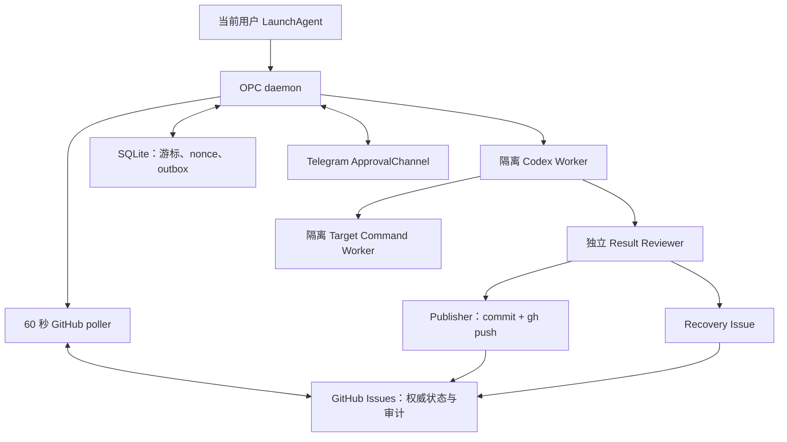
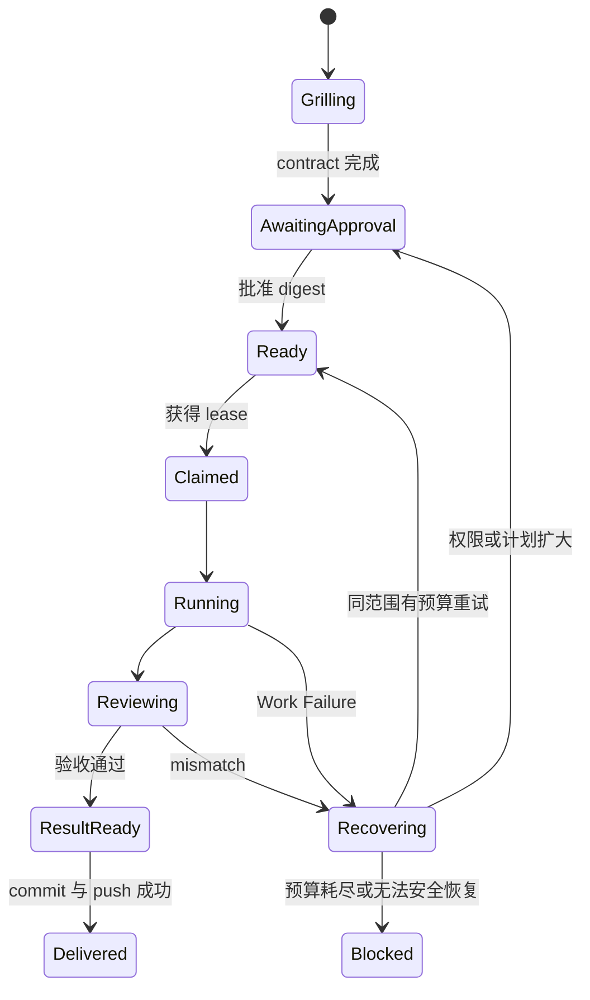

# OPC 当前用户 Daemon 设计

状态：已批准设计，待实施计划
日期：2026-08-10
实现语言：Bun + TypeScript

## 1. 决策摘要

OPC v2 改为在用户当前登录的 macOS 账户下运行一个 Bun/TypeScript daemon。daemon 由用户级 LaunchAgent 管理，在登录后启动，通过出站轮询 GitHub Issues 发现任务，并直接完成领取、Codex 执行、验证、commit、push、通知和有界恢复。

本设计明确取代以下旧方向：

- 不再创建 `opc-runner` macOS 用户。
- 不再注册或依赖 GitHub Actions self-hosted runner。
- 不再使用 GitHub Actions cron 作为主要调度器。
- 不再写入 `/etc/codex` 或安装机器级 Codex requirements。
- 不安装系统级 LaunchDaemon，不要求 sudo，不在未登录状态运行。
- 不复用日常 `~/.codex`；OPC 使用独立 `CODEX_HOME`。

以下既有原则保持不变：

- 计划批准绑定到不可变 contract digest。
- 每个仓库最多一个 active execution。
- 结果验证与代码生成相互独立。
- 只在已批准的私有仓库、路径、命令和权限范围内执行。
- 失败必须有稳定分类、证据、恢复预算和可审计状态转换。
- 默认安静；用户只处理计划批准、权限扩大、阻塞和最终结果。

本文是新架构的权威设计。旧设计、ADR、runbook 和模板中与本节冲突的内容必须在实施时迁移或标记为 superseded，不能同时作为生产约束。

## 2. 用户目标

OPC 必须把用户的注意力压缩到两个表面：

1. **计划表面**：grill 需求、确认 milestone、验收标准、权限和预算，然后批准精确计划。
2. **结果表面**：查看 commit、验证证据和最终状态；只有真正需要扩大权限或作出产品决定时才被打断。

标准闭环为：

```text
grill -> plan -> submit awaiting-approval Issue -> approve digest
      -> daemon claim -> execute -> verify -> commit -> push -> result
      -> failure/mismatch -> Recovery Issue -> bounded retry
```

用户不需要观察轮询、Codex 输出、测试进度、暂时网络故障或同范围内的恢复尝试。

## 3. 系统范围

### 3.1 v2 包含

- 当前用户 LaunchAgent。
- Bun/TypeScript 常驻 daemon。
- GitHub Issues 任务队列和权威 transition journal。
- 本地 SQLite 游标、Telegram nonce 和 outbox。
- `gh` onboarding、Issue 操作和 Git push。
- 独立 OPC `CODEX_HOME` 和 Codex CLI planner/executor/reviewer。
- Telegram 计划批准、权限确认和结果通知。
- OS 强制的进程与文件访问隔离。
- 有界自动恢复、lease、heartbeat、幂等和崩溃重放。
- 本机 CLI：onboard、daemon、status、pause、resume、doctor、upgrade、uninstall。

### 3.2 v2 不包含

- 新 macOS 用户或要求用户授予管理员权限。
- 开机未登录运行。
- 公网 webhook、本机入站端口或 SSH 控制面。
- GitHub Actions Runner、gh-aw、Temporal 或其他外部调度平台。
- 自动获得 Full Disk Access、Accessibility 或其他 macOS 隐私权限。
- 自动扩大网络、目录、仓库、模型或执行预算。
- 无确认自动升级 daemon。
- 多租户、跨 GitHub owner 或公共仓库执行。

## 4. 总体架构



### 4.1 权威数据

GitHub Issue 是跨重启、跨版本和跨机器可审计的权威记录。它保存：

- immutable Execution Contract；
- plan digest 和批准证据；
- claim、heartbeat、state transition；
- attempt、failure category、error fingerprint；
- Result Manifest、Result Review 和 commit URL；
- Recovery Issue 与 root Work 的链路。

SQLite 不是任务状态的权威来源，只保存可重建或本机专属的数据：

- ETag 和轮询游标；
- Telegram pairing、nonce 使用记录和待发送 outbox；
- 本机 process lock 和 installation ID；
- 可丢弃的性能缓存。

删除 SQLite 后，daemon 必须能从 GitHub transition journal 重建任务状态。Telegram pairing 等不能安全推导的本机数据必须 fail closed 并要求重新配对。

### 4.2 轮询

- daemon 默认每 60 秒轮询已 onboard 仓库。
- 使用 ETag、指数退避和随机抖动减少 API 压力与惊群。
- 只使用出站 HTTPS，不监听本机端口。
- GitHub 认证失败时停止新转换并通知用户，不把认证失败误判为 Work Failure。
- Mac 睡眠或断网恢复后，先 reconcile lease，再领取新任务。

### 4.3 单仓库串行化

同一仓库同一时间最多一个 active execution。单机 process lock 防止本机重复 daemon；GitHub claim protocol 防止同一仓库被两个安装同时执行。

claim record 至少包含：

- `installation_id`；
- `lease_id`；
- `work_id`；
- `plan_digest`；
- `claimed_at`；
- `lease_expires_at`；
- 签名 transition payload。

写入 claim 后必须重新读取 Issue。若出现竞争，以最早的有效 claim transition 为赢家，其他安装撤销本地工作并进入 no-op。标签只是 projection，不能覆盖签名 transition journal 的权威状态。

### 4.4 从 grill 到队列

grill 和计划生成不是 daemon 的隐式后台行为。它们发生在用户可见的 planning surface，例如当前 Codex 对话中的 `grill-with-docs` 流程，或未来原生 App。

planning surface 完成 canonical Execution Contract 后调用：

```text
opc submit <contract.json>
```

`submit` 必须：

1. 本地验证 contract schema、repository allowlist、base SHA、权限 ceiling 和 canonical digest。
2. 在 GitHub 创建或复用唯一 root Work Issue，初始状态为 `awaiting-approval`。
3. 把完整 contract 放入可安全 round-trip 的结构化载荷，而不是脆弱的 Markdown code fence parser。
4. 让 daemon 发现该 Issue 并经 Telegram 发送批准请求。
5. 只有相同 digest 被批准后才转换为 `ready`；poller 只 claim `ready` Work。

相同 `work_id` 和 digest 的重复 submit 必须返回已有 Issue；相同 `work_id`、不同 digest 必须 fail closed。这样 planning surface 可以安全重试，而不会创建重复任务。

## 5. Onboarding 与用户授权

Onboarding 分成三个独立确认阶段。任何阶段都能退出，前一阶段不能暗示后一阶段已获批准。

### 5.1 阶段一：安装但不启用

`opc onboard` 先生成 permission manifest，展示所有将创建或修改的路径。用户本机确认后，才可以创建：

- `~/.local/bin/opc`；
- `~/Library/Application Support/OPC/`；
- `~/Library/Logs/OPC/`；
- `~/Library/LaunchAgents/com.getsuperpower.opc.plist`。

安装完成时必须保持 `OPC_ENABLED=false`，不得领取或执行任务。

### 5.2 阶段二：身份与仓库配置

GitHub onboarding：

1. 执行只读 `gh auth status`。
2. 展示当前 GitHub 用户、host 和目标仓库。
3. 未登录时暂停，由用户亲自运行 `gh auth login`。
4. 逐仓库请求“允许 OPC 使用此 GitHub 身份”的批准。
5. 验证仓库为同 owner 的私有、非 fork 仓库，并写入 allowlist。
6. 使用 `gh api` 操作 Issues；push 时仅为 Publisher 临时调用 `gh auth git-credential`。

OPC 不接收或保存 GitHub PAT，不运行会修改全局 Git 配置的 `gh auth setup-git`，也不把 GitHub token 导出给仓库命令或 Codex 子进程。

Codex onboarding：

- 使用 `~/Library/Application Support/OPC/codex` 作为独立 `CODEX_HOME`。
- 用户亲自完成 ChatGPT/Codex 订阅账户登录。
- daily Codex 的 `~/.codex` 不能被读取、修改或作为 fallback。
- planner、executor 和 reviewer 使用 host-owned、digest-pinned profile。

Telegram onboarding：

- 用户自行创建 bot，并在本机输入 bot token。
- bot token 只进入 OPC 专属 macOS Keychain 条目。
- 首次 pairing 使用一次性 code，并固定允许的 Telegram user ID 和 chat ID。
- Telegram 消息不得包含 GitHub、Codex、SSH 或其他凭证。

Transition signing：

- 首次身份配置时生成随机 256-bit installation signing key，并与 Telegram bot token 分开存入 OPC 专属 Keychain 条目。
- GitHub transition payload 使用版本化 canonical JSON 和 HMAC-SHA-256；key ID 和 installation ID 可以公开，secret 不得离开 Keychain。
- daemon 重启和升级必须复用同一 signing key。
- signing key 缺失、不可读或与已有 journal 不匹配时停止领取，进入 `USER_ACTION_REQUIRED`；不得信任未签名标签来继续执行。
- key rotation 是显式迁移：旧 key 在所有 active lease 结束前只用于验证，新 key 只签新 transition，并把 rotation record 写入 GitHub。
- uninstall 默认保留 signing key，除非用户明确选择永久移除；移除后现有 journal 只能作为审计记录，重新启用必须创建新 installation identity。

### 5.3 阶段三：最终启用

最终确认必须重新展示：

- GitHub 身份与逐仓库 allowlist；
- Telegram 身份；
- Codex home、profile、model 和 reasoning effort；
- 可读写目录；
- 网络默认策略；
- attempts、timeout 和恢复预算；
- LaunchAgent 路径和启动条件。

只有用户在本机批准这份 manifest 后，OPC 才能设置 `OPC_ENABLED=true` 并加载 LaunchAgent。

## 6. 批准模型

Telegram 是交互入口，GitHub Issue 是永久批准记录。

### 6.1 Execution Contract

每个计划必须生成 canonical JSON Execution Contract，至少包含：

- repository 和 base SHA；
- target branch；
- milestone、goal、acceptance criteria；
- allowed paths 和 forbidden paths；
- bootstrap、test、evidence 命令；
- timeout 和 attempts；
- network、directory 和其他 capability grants；
- Codex profile/model policy；
- plan version。

批准对象是 canonical contract 的 SHA-256 digest，不是可编辑的自然语言摘要。

### 6.2 Telegram 批准

批准请求包含：

- root Work URL；
- 人类可读计划摘要；
- contract digest；
- 一次性 nonce；
- 过期时间；
- Approve 和 Reject 操作。

daemon 只接受已配对 Telegram 身份、未使用 nonce、未过期请求和完全相同 digest。批准后，daemon 把签名 approval transition 写回 GitHub Issue。Issue、base SHA、policy 或 contract 变化时，批准立即失效。

### 6.3 权限扩大

以下变化必须请求新的 Telegram 批准：

- 新增网络访问；
- 新增目录或扩大 writable paths；
- 修改 milestone 或 acceptance criteria；
- 提高 attempts、timeout 或资源预算；
- 改变 model/profile；
- 改变 repository 或 target branch。

Telegram 不能授予 macOS 系统权限。需要文件夹访问、Keychain、登录或其他本机动作时，daemon 进入 `USER_ACTION_REQUIRED`，并要求用户运行明确的本机命令。

## 7. 状态模型

### 7.1 状态

```text
grilling
awaiting-approval
ready
claimed
running
reviewing
recovering
result-ready
delivered
blocked
```

### 7.2 主流程



所有转换必须由 domain state machine 验证。terminal state 不允许被标签修改或重复事件复活。

### 7.3 Lease 与 heartbeat

- heartbeat 默认每五分钟写入一个签名 transition。
- 30 分钟没有有效 heartbeat 的 claim 视为 stale。
- reconcile 必须先判断 Mac sleep、认证失效或基础设施故障，再决定 requeue。
- stale infrastructure claim 回到 `ready`，不消耗 attempt。
- 同一 attempt 的重复事件必须 dedupe，不能创建平行 Recovery。

## 8. 执行、验证与发布

### 8.1 权限域

运行时至少拆分为四个权限域：

1. **Controller**：GitHub、Telegram、lease 和通知；不能执行 Target 命令。
2. **Codex Worker**：独立 OPC `CODEX_HOME` 和指定 worktree；拿不到 GitHub 或 Telegram 凭证。
3. **Target Command Worker**：只有 worktree 和 temp；默认无网络，禁止访问用户凭证区域。
4. **Publisher**：在 hash 验证后短暂获得 commit 和 push 能力。

隔离必须由 macOS 进程 sandbox 强制，不能仅依赖清理环境变量。

### 8.2 执行步骤

1. 重新验证 `OPC_ENABLED`、repository allowlist、policy、base SHA 和 contract digest。
2. 创建独立 git worktree。
3. 在 Target Command Worker 内运行获批 bootstrap。
4. 在 Codex Worker 内运行 planner/executor profile。
5. 收集 changed paths、command results 和 evidence。
6. 在独立 reviewer profile 中验证 Result Manifest 和 acceptance criteria。
7. 验证没有 forbidden path、untracked payload 或未索引 evidence。
8. Publisher 创建单一 commit，并通过 `gh` credential helper push。
9. 写入 Result transition 和 commit URL。
10. 清理 worktree、临时文件和残留进程。

### 8.3 Deadline

每个 attempt 使用一个 absolute deadline。bootstrap、Codex、evidence、review 和 cleanup 消耗同一预算，不能每个阶段重新获得完整 timeout。cleanup 必须保留固定 grace period。

## 9. 失败与恢复

### 9.1 稳定分类

- `USER_ACTION_REQUIRED`：登录、配对、Keychain 或本机权限需要用户动作。
- `CONTRACT_VIOLATION`：digest、路径、状态、policy 或批准不一致。
- `WORK_FAILURE`：代码、测试、验收或 reviewer 失败，消耗 attempt。
- `INFRASTRUCTURE_FAILURE`：网络、GitHub、Codex 服务、Mac sleep 或 daemon crash，不消耗 attempt。

错误分类必须来自结构化 report，不得依赖 workflow、命令或步骤的显示名称。

### 9.2 Recovery Issue

Work Failure 或结果偏离计划时创建子 Recovery Issue。它必须包含：

- root Work ID 和 parent Issue；
- original plan digest 和 approval digest；
- current attempt 和 next attempt；
- failure category、stable error code 和 fingerprint；
- evidence references；
- repair hypothesis；
- 是否仍在原 contract 权限范围内。

同一个 `(root_work_id, next_attempt)` 是唯一 Recovery slot。fingerprint 改变不能创建第二条相同 attempt 的 Recovery；内容冲突必须 fail closed。

### 9.3 有界自动恢复

- 修复仍在原 milestone、paths、permissions 和 attempts 内时，可以自动 requeue。
- 任何 scope expansion 回到 `awaiting-approval`。
- 基础设施故障不消耗 attempt，但连续 outage 24 小时后进入 `blocked`。
- attempts 耗尽后进入 `blocked`，不得创建更多执行槽位。
- 用户只收到首次批准、scope expansion、24 小时 blocker、attempt exhaustion 和最终结果。

## 10. Feature-first 深模块结构

代码按用户目的组织，而不是先按 domain/application/adapters 等技术层切开。每个 feature 是一个深模块：调用者通过小 interface 获得完整行为，复杂实现和内部 seams 保持在 feature 内。

建议目录：

```text
src/
  features/
    onboarding/
      index.ts
      onboarding.ts
      permission-manifest.ts
      repository-allowlist.ts
    planning/
      index.ts
      execution-contract.ts
      plan-digest.ts
    approvals/
      index.ts
      request-approval.ts
      consume-approval.ts
      approval-record.ts
    queue/
      index.ts
      poll-and-claim.ts
      lease.ts
      reconcile.ts
    delivery/
      index.ts
      run-delivery.ts
      execution.ts
      verification.ts
      publication.ts
    recovery/
      index.ts
      classify-failure.ts
      recover-work.ts
      recovery-slot.ts
  runtime/
    delivery-loop.ts
    daemon.ts
    enabled-gate.ts
  platform/
    github/
      gh-cli-github-adapter.ts
      in-memory-github-adapter.ts
    approvals/
      telegram-approval-adapter.ts
      in-memory-approval-adapter.ts
    codex/
      codex-cli-adapter.ts
      fake-codex-adapter.ts
    sandbox/
      macos-sandbox-adapter.ts
      fake-sandbox-adapter.ts
    journal/
      sqlite-journal-adapter.ts
      in-memory-journal-adapter.ts
  cli/
    main.ts
    commands/
```

### 10.1 External seam

daemon 只依赖一个小的 delivery-loop interface，例如：

```ts
export interface DeliveryLoop {
  tick(now: Date): Promise<TickResult>;
}
```

`tick` 隐藏 poll、claim、approval、execute、review、publish、recover 和 outbox flush 的次序。调用者不需要学习每个内部步骤，也不能绕过 domain invariants。

CLI 通过 onboarding、status 和 lifecycle feature 的 interface 工作；CLI command 不直接拼接 GitHub、SQLite 或 LaunchAgent 操作。

### 10.2 真实 seams

只为确实变化的外部依赖建立 port：

- GitHub：`gh` production adapter + in-memory test adapter。
- ApprovalChannel：Telegram adapter + in-memory test adapter；未来原生 App 是第三个 adapter。
- Codex：CLI adapter + deterministic fake。
- SandboxRunner：macOS adapter + security-probe fake/fixture。
- LocalJournal：SQLite adapter + in-memory adapter。

不为只有一个实现的 helper 建立 pass-through interface。纯 canonicalization、state transition、digest 和 policy 逻辑直接保留在所属 feature 内。

### 10.3 依赖规则

- `cli` 和 `runtime` 可以调用 feature interface。
- feature 不导入另一个 feature 的 implementation；跨 feature 只使用明确的结果类型或由 delivery loop 编排。
- `platform` adapter 实现 feature 所拥有的 port，feature 不依赖 adapter。
- shared 目录不是默认选择；只有至少两个 feature 出现完全相同的稳定领域概念时才提取。
- 每个 feature 的 `index.ts` 是唯一公开入口；测试和调用者不得 deep import implementation。
- interface 同时是测试表面；测试断言可观察结果，不锁定内部调用顺序。

这些规则追求 leverage 和 locality：一次修复在深模块内生效，调用者不需要复制状态转换、错误映射或权限检查。

## 11. CLI 与运维

### 11.1 Commands

- `opc onboard`：预览并分阶段申请安装、身份和启用权限。
- `opc submit <contract.json>`：验证并幂等创建等待批准的 root Work Issue。
- `opc daemon`：LaunchAgent 调用的前台长进程。
- `opc status`：显示 enabled、身份、仓库、poll、lease、outbox 和版本。
- `opc pause`：停止新转换，允许安全 cleanup。
- `opc resume`：重新验证 permission manifest 后恢复。
- `opc doctor`：只读验证 gh、Codex、Telegram、sandbox、SQLite 和仓库访问。
- `opc upgrade`：展示 checksum、迁移和权限 diff，批准后升级。
- `opc uninstall`：停止 LaunchAgent，分别确认删除程序、状态、日志和 Keychain 条目。

### 11.2 LaunchAgent

- plist 位于当前用户 `~/Library/LaunchAgents`。
- 登录后启动并由 launchd 在异常退出时重启。
- plist 只包含非秘密配置路径，不包含 token。
- daemon 自身必须有 watchdog；launchd 只能重启退出进程，不能判断逻辑卡死。
- `doctor` 必须检测长时间无 successful poll、outbox 堆积和 stuck lease。

### 11.3 日志

- 本地结构化 JSON 日志按大小和时间轮转。
- GitHub 仅写状态、证据摘要和 stable error code，不上传原始 secret-bearing stdout。
- logger 在序列化前移除 token、Authorization header、Telegram payload secrets、Codex auth 和 credential-helper 内容。
- 默认日志保留期和最大磁盘预算写入 permission manifest。

## 12. 安全模型与限制

当前用户 daemon 与用户拥有相同 Unix 身份，因此“用户已确认”是授权 UX，不是安全隔离。实际保护依赖以下机制共同成立：

- Controller、Codex、Target 命令和 Publisher 使用不同 OS sandbox profile。
- Target 命令禁止读取 `~/.codex`、OPC `CODEX_HOME`、`~/.config/gh`、SSH、Keychain、浏览器数据和个人目录。
- Target 命令默认禁止网络；允许时只开放 contract 中的 host/port 或受控代理。
- Codex Worker 不获得 GitHub 或 Telegram credential。
- Publisher 不运行 Target 代码，只验证已冻结 worktree 后 commit/push。
- Controller 不解释或执行仓库提供的命令。
- 任何 sandbox probe 失败都 fail closed。

已知限制：同一用户下若 OPC Controller 自身被完全攻陷，macOS 用户身份仍提供较大权限面。v2 通过最小 controller implementation、sandbox、仓库 allowlist 和不暴露入站端口降低风险，但不能达到独立非管理员用户的内核级账户隔离。若真实使用证据表明该剩余风险不可接受，后续版本应迁移到签名原生 App sandbox、虚拟机或专用主机，而不是静默扩大当前用户权限。

## 13. 可观测性与用户体验

默认不发送进度噪音。Telegram 只发送：

- 新计划等待批准；
- scope expansion；
- 用户本机动作要求；
- attempts 耗尽或 24 小时 blocker；
- 最终 Delivered 结果。

最终结果必须包含：

- Work Issue URL；
- plan digest；
- commit URL 和 target branch；
- changed paths；
- tests/evidence 摘要；
- Result Review；
- consumed attempts；
- 实际使用的权限清单。

## 14. 测试策略

### 14.1 Interface-first tests

测试通过 feature interface 验证行为。内部重构不应迫使测试改变；若测试必须 deep import 或断言私有调用次序，说明 module 或 seam 位置不正确。

### 14.2 测试层级

- Domain：canonical JSON、digest、state machine、lease、budget、failure classification。
- Feature：通过 in-memory adapters 测试完整 use case。
- Adapter contract：同一套 contract tests 验证 production 与 in-memory adapters 的可观察语义。
- Daemon：虚拟 clock 测试 polling、ETag、backoff、sleep/wake、outbox 和 24 小时 blocker。
- Crash injection：在 claim、execute、review、commit、push 和 transition write 前后终止并重放。
- Race：两个 installation 同时 claim，最多一个进入 Running。
- Security probes：真实尝试读取禁止路径、访问 Keychain、调用 credential helper 和访问未批准网络，必须失败。
- macOS acceptance：真实 LaunchAgent、Telegram pairing、Codex dry-run、sandbox repo 和测试仓库 push。

### 14.3 必须锁定的场景

1. 安装阶段未最终启用，daemon 不产生任何 GitHub transition。
2. `gh` 未登录或身份变化，fail closed。
3. repository 未逐项批准，不轮询、不 clone、不 push。
4. plan 内容或 base SHA 改变，旧 Telegram 批准失效。
5. 重复 submit 相同 work ID/digest 复用 Issue；不同 digest 冲突并 fail closed。
6. Telegram replay、错误 user/chat、过期 nonce 被拒绝。
7. signing key 缺失或 journal 签名不匹配时停止领取。
8. Target 命令无法读取 daily Codex、OPC Codex、gh、SSH 和 Keychain。
9. Target 命令无批准网络时连接失败。
10. 两个 daemon 竞争时只有一个有效 claim。
11. daemon 在 push 后、结果 transition 前崩溃，不产生第二个 commit。
12. Work Failure 创建唯一 Recovery slot 并消耗 attempt。
13. Infrastructure Failure 不消耗 attempt，24 小时后 blocker。
14. 结果偏离 acceptance 时不 push 或不标记 Delivered。
15. permission expansion 必须重新批准。
16. terminal state 不能被 relabel 或重放复活。
17. SQLite 删除后能从 GitHub 重建权威工作状态。

## 15. 交付阶段

### M1：架构迁移与兼容边界

- 新 spec/ADR 与 superseded 决策索引。
- feature-first 目录和 delivery-loop interface。
- 移除 production path 中的 `opc-runner`、GitHub Actions Runner 和 `/etc/codex` 假设。
- 保持既有 domain contracts 与 tests 可迁移。

### M2：Daemon Core

- poller、SQLite、installation ID、process lock。
- GitHub transition journal、claim、lease、heartbeat 和 reconcile。
- pause/resume/status/doctor。

### M3：Onboarding 与批准

- 三阶段 permission manifest。
- `gh` 身份与 repository allowlist。
- 独立 `CODEX_HOME`。
- Telegram pairing、nonce、approval 和 outbox。
- 当前用户 LaunchAgent。

### M4：隔离交付闭环

- Controller/Codex/Target/Publisher sandbox profiles。
- execution、review、commit、push。
- structured failure report、Recovery Issue 和 bounded retry。

### M5：真实验收与 rollout

- 本机 security probes。
- 专用私有测试仓库端到端 dry-run。
- crash/race/sleep/offline scenarios。
- 用户批准后才 onboard 第一个真实仓库。

每个 milestone 必须独立可验证和可回滚。不得先安装 daemon，再补 permission gate 或 sandbox。

## 16. 设计验收条件

进入实施前必须满足：

- 用户已批准 custom Bun/TypeScript daemon，而不是 GitHub Actions Runner。
- 用户已批准当前用户 LaunchAgent，接受“重启后需要登录一次”。
- 用户已批准三阶段本机授权。
- 用户已批准复用当前 `gh` 身份并逐仓库授权。
- 用户已批准独立 OPC `CODEX_HOME`。
- 用户已批准 Telegram 作为 v2 ApprovalChannel，并保留未来 App adapter seam。
- 用户已批准 Target 命令默认无网络、最小目录权限和 scope expansion 再批准。
- 用户已批准 GitHub Issue 为权威状态、SQLite 为可重建本机状态。
- 用户已批准 feature-first 深模块结构和 interface-first 测试策略。

本设计已在对话中逐节批准。下一步是对本文进行用户书面审阅，然后生成逐任务、测试优先、可小步提交的实施计划；在实施计划获批前不修改生产代码或本机配置。
