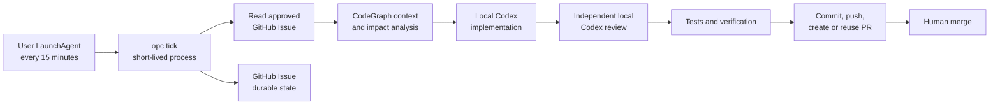

# OPC Local Scheduled Delivery Design

**Date:** 2026-08-16
**Status:** Approved
**Repository:** `devos-ing/opc-it`

## Decision

OPC scheduled delivery runs completely on the developer's Mac under the current macOS user. A user-level `launchd` timer starts one short-lived `opc tick` process every 15 minutes. The tick reads approved GitHub Issues, performs implementation, independent review, verification, commit, push, and pull-request creation locally, then exits.

GitHub remains the durable Issue queue, source repository, and pull-request host. GitHub Actions does not schedule or execute OPC delivery. A self-hosted GitHub Actions runner and a dedicated local user are not required. Pull requests are never merged automatically.

This design supersedes the GitHub-native cron and self-hosted-runner execution route in `2026-08-14-opc-scheduled-delivery-rescope-design.md` for the local-development deployment.

## Goals

- Use the existing macOS user and existing `gh`, Git/SSH, and Codex authentication.
- Run the complete delivery pipeline locally without GitHub Actions execution.
- Keep GitHub Issues as the durable approval and work queue.
- Process at most one work item at a time.
- Support an explicit local repository allowlist, initially containing only `devos-ing/opc-it`.
- Use CodeGraph to bound code exploration and impact analysis before modification.
- Make retries idempotent across process crashes, sleep, network loss, and partial publication.
- Create or reuse one pull request and require human merge.
- Provide simple install, run-once, status, and uninstall commands.

## Non-goals

- No always-running OPC daemon.
- No GitHub self-hosted runner.
- No dedicated `opc-runner` account, sudo operation, or system-level service.
- No automatic pull-request merge.
- No parallel task execution in the first version.
- No copying, printing, or separately persisting the user's GitHub, SSH, or Codex credentials.
- No new graph database or graph-backed workflow state store.

## System Boundary



The LaunchAgent is only a timer and process launcher. It owns no workflow state. Each tick acquires a local single-instance lock, performs one bounded unit of work, records the durable outcome in GitHub, releases the lock, and exits.

If the Mac is asleep or offline, no work runs. The next launch after wake performs a normal reconciliation tick; missed intervals do not create concurrent catch-up runs.

## Tick Flow

One tick performs these steps in order:

1. Load and validate the current-user configuration.
2. Verify the selected repository is enabled and explicitly allowlisted.
3. Verify the local and repository kill switches permit execution.
4. Verify required tools, authentication, repository authority, and a healthy CodeGraph index.
5. Acquire the local single-instance lock. Exit successfully when another tick owns it.
6. Reconcile any previously claimed work, remote branch, or pull request.
7. Select at most one approved, non-terminal GitHub Issue.
8. Revalidate approval and claim the Issue durably.
9. Create or reuse an isolated worktree and deterministic `codex/issue-<number>` branch.
10. Ask CodeGraph for the relevant symbols, callers, callees, and change impact.
11. Run a local Codex implementation attempt inside the bounded worktree.
12. Run an independent local Codex review with fresh context.
13. Run repository-defined tests, type checks, lint, and required evidence gates.
14. Revalidate repository, approval, policy, base commit, and kill switches immediately before each publication mutation.
15. Create or reuse the exact commit, remote branch, and pull request.
16. Record the result on the Issue, release the lock, and exit.

## CodeGraph Role

CodeGraph is a required local code-understanding dependency, not a workflow-state service.

- Before implementation, it identifies definitions, call paths, and likely affected modules.
- During planning, it constrains the intended edit surface.
- During review, it checks that callers and dependents were not missed.
- GitHub remains the durable task and publication authority.

If CodeGraph is unavailable, unhealthy, or missing its index, the tick makes no source modification. It records a concise diagnostic on the Issue and exits for a later retry.

## Local Configuration

The current-user configuration has this conceptual shape:

```yaml
interval_minutes: 15
max_concurrency: 1

repositories:
  - github: devos-ing/opc-it
    checkout: /Users/roy/Documents/ChatGPT/OPC
    enabled: true
```

Rules:

- Repository names are canonical `owner/name` values.
- Checkout paths are canonical absolute paths owned by the current user.
- Every operation must remain under the configured repository or its controlled worktree root.
- Adding another repository requires an explicit allowlist entry; it never happens through Issue content.
- `max_concurrency` is fixed to one in the first version.
- The LaunchAgent and the manual `run-once` command use the same configuration and tick implementation.

## Credentials and Permissions

- The tick inherits the current user's existing `gh`, Git/SSH, and Codex authentication.
- The installer does not read or copy credential contents.
- No registration token or GitHub runner credential is created.
- No token is written into the LaunchAgent plist or OPC configuration.
- The process may push only a deterministic feature branch for an allowlisted repository.
- Direct pushes to the default branch and automatic merge are forbidden.
- Publication requires current approval and a matching base commit at every mutation boundary.

## State and Idempotency

The durable happy path remains:

```text
approved -> running -> reviewing -> result-ready -> delivered
```

`delivered` means the human merged the pull request. OPC stops at `result-ready` after publication.

Retries reconcile physical Git state before creating anything:

- Existing exact worktree or branch is reused only after identity validation.
- Existing exact commit is reused only when its parent, tree, work identity, and approval identity match.
- Existing exact pull request is reused only when repository, head, base, commit, and work identity match.
- Ambiguous or conflicting physical state becomes a human-attention state rather than being overwritten.
- Retry counts are bounded; exhaustion produces a clear needs-decision result.

The first version does not create a hierarchy of Recovery Issues. Recovery is represented by the original Issue's durable state plus the validated local/remote worktree, branch, commit, and pull request.

## Failure Behaviour

- **Mac asleep or powered off:** no work runs; the next tick reconciles normally.
- **Another tick is active:** the new tick exits without claiming work.
- **GitHub, Codex, or CodeGraph unavailable:** no new mutation; record a retryable diagnostic when possible.
- **Implementation or verification failure:** do not publish; preserve bounded evidence and return the Issue to a retryable or human-attention state.
- **Crash after push but before PR creation:** verify and reuse the exact pushed branch, then create the missing PR.
- **Crash after PR creation but before Issue update:** verify and reuse the exact PR, then repair the Issue projection.
- **Approval, policy, base, or kill-switch drift:** stop before the next mutation and require reapproval.
- **Repeated failure:** stop at the configured retry ceiling and request human action.

## Installation and Operations

The development installer exposes four user-facing operations:

- `install`: validate dependencies and an existing approved disabled daemon configuration, write the explicit private current-user scheduler configuration, prove both exact configuration files, and install/load the user LaunchAgent while execution remains disabled.
- `run-once`: execute one tick in the foreground with the same validation and lock.
- `status`: show LaunchAgent state, current lock/attempt summary, allowlisted repositories, and last outcome without exposing secrets.
- `uninstall`: unload and remove the LaunchAgent and OPC-owned scheduling files without deleting repositories, branches, Issues, or pull requests.

The LaunchAgent runs as the current user, has no `sudo` requirement, and starts a short-lived process. Logs are bounded and stored in a private current-user OPC directory.

The lifecycle is a staged authority pair. Approved onboarding writes the
disabled daemon configuration and matching scheduler LaunchAgent plist without
bootstrapping. The development installer does not reconstruct that authority:
it requires the exact private current-user daemon configuration, records only
the explicitly supplied repository/checkout mapping, and re-reads both
canonical files before bootstrap. Activation likewise requires both files to
match the exact approved onboarding repository set, the explicit canonical
current-user checkout mapping, and the enabled scheduler state immediately
before it enables or bootstraps the same scheduler job. Missing, stale, unsafe,
subset, superset, or mismatched authority fails closed; no checkout is inferred.

## Migration from the Runner Route

Migration is ordered to avoid losing the existing disabled safety boundary:

1. Keep `OPC_ENABLED=false` and the repository pipeline disabled.
2. Implement and verify `run-once` locally without publication.
3. Verify publication against a controlled test Issue.
4. Install the LaunchAgent while execution remains disabled.
5. Remove the repository's GitHub Actions cron/runner dependency.
6. Deregister the retained offline runner `opc-dev-roy-arm64` using exact remote identity.
7. Remove the exact retained staging directory only after local identity validation.
8. Enable the local repository entry and perform one observed tick.

Runner deregistration and staging cleanup are explicit migration operations, not implicit installer side effects.

## Verification

Required automated coverage includes:

- allowlist acceptance and rejection;
- current-user configuration permissions and canonical checkout validation;
- LaunchAgent rendering, installation idempotency, status, and uninstall;
- single-instance lock contention and stale-owner recovery;
- kill-switch and approval checks before any modification;
- CodeGraph unhealthy or missing-index fail-closed behaviour;
- one-task selection and deterministic worktree/branch naming;
- independent implementation and review contexts;
- verification failure with zero publication;
- crash recovery before commit, after push, and after PR creation;
- exact branch/commit/PR reuse with duplicate prevention;
- drift immediately before commit, push, and PR creation;
- no direct default-branch push and no automatic merge;
- absence of GitHub Actions cron and self-hosted-runner execution dependencies.

The live acceptance test uses one controlled Issue in `devos-ing/opc-it`, observes one local tick, verifies one branch and one pull request, and leaves merge to the user.

## Success Criteria

The design is complete when a current-user installation can, without GitHub Actions execution or a self-hosted runner:

1. wake every 15 minutes;
2. select at most one approved Issue from an allowlisted repository;
3. use CodeGraph, Codex implementation, independent review, and repository verification locally;
4. create or reuse exactly one commit, branch, and pull request;
5. recover safely on the next tick after interruption; and
6. stop at a human-merge boundary.
